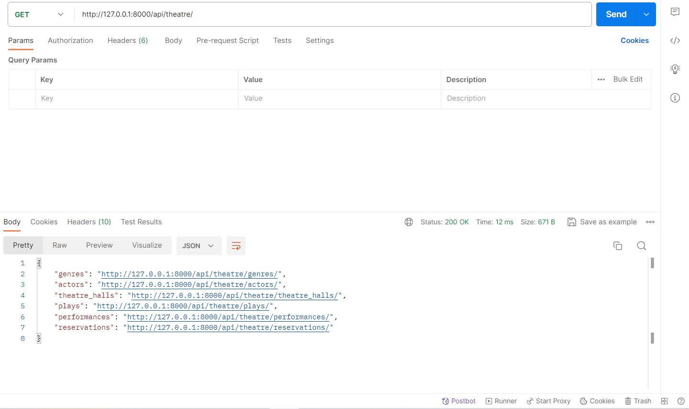

# **Theatre-API-Service**
A REST Framework API for organizing plays, performances, performers, and more, Theatre API Service is built on Django. It offers endpoints for order administration, user registration, and the creation, updating, and retrieval of thatre-related data.

### **Table of Contents**
* [Introduction]()
* [Features]()
* [Installation]()
* [Endpoints]()
* [Presentation]()

### **Introduction**
The purpose of the Theatre API Service is to manage user interactions and data linked to theaters more efficiently. This project offers a strong foundation whether you're creating a play reservation system, an app for theaters, or you're just investigating Django REST APIs.

#### **Features:**
* CRUD operations for theater spaces, performers, plays, performances, and orders.
* Include pictures for plays.
* Validation of tickets subject to cargo and seat availability.

## **Installation**
1. Clone the repository:

`git clone https://github.com/elenkomar/Theatre-API-Service.git`

2. Create .env file and define environmental variables following .env.example:

`POSTGRES_HOST= your db host`

`POSTGRES_DB= name of your db`

`POSTGRES_USER= username of your db user`

`POSTGRES_PASSWORD= your db password`

`SECRET_KEY= your django secret key`

3. Run command:

`docker-compose up --build`

4. App will be available at: `127.0.0.1:8000`

5. Login using next credentials:

`test@14.com`

`test1422`

## **Endpoints**
`"user" : 

                "http://127.0.0.1:8000/api/user/register/"
                "http://127.0.0.1:8000/api/user/me/"
                "http://127.0.0.1:8000/api/user/token/"
                "http://127.0.0.1:8000/api/user/token/refresh/"`

`"theatre" : 

             "http://127.0.0.1:8000/api/theatre/genres/"
             "http://127.0.0.1:8000/api/theatre/actors/"
             "http://127.0.0.1:8000/api/theatre/plays/"
             "http://127.0.0.1:8000/api/theatre/theatre_halls/"
             "http://127.0.0.1:8000/api/theatre/performances/"
             "http://127.0.0.1:8000/api/theatre/reservations/"`

`"documentation": 

                "http://127.0.0.1:8000/api/doc/"
                "http://127.0.0.1:8000/api/swagger/"
                "http://127.0.0.1:8000/api/redoc/"`

## **Schema**

## **Presentation**

